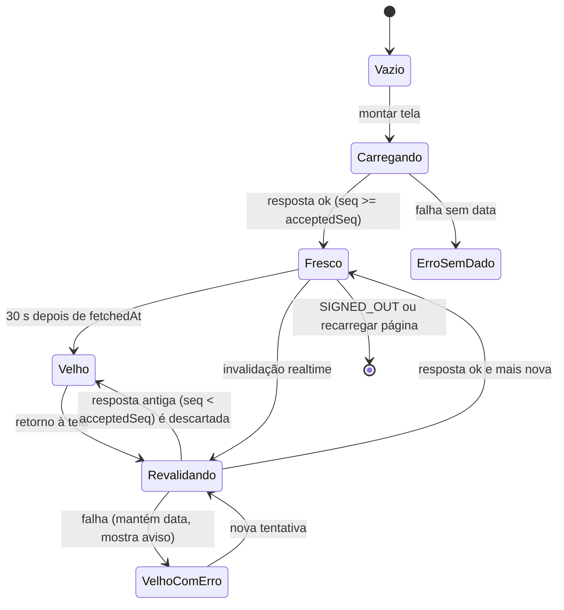

# Modelo de Dados (Fase 1): Otimizar Performance do CRM

**Spec**: [spec.md](./spec.md) · **Pesquisa**: [research.md](./research.md)

Só duas coisas mudam no banco: a tabela nova `performance_traces` e a função `product_metrics()`. O resto são estruturas em memória (servidor ou browser) que o plano precisa nomear pra testar.

---

## 1. `performance_traces` (tabela nova, persistida)

Traço de Performance da spec. Uma linha por **etapa medida**, agrupada por `trace_id`.

| Coluna | Tipo | Regra |
|---|---|---|
| `id` | `bigint generated always as identity` | PK |
| `trace_id` | `uuid not null` | Gerado no browser por jornada; propagado em `x-trace-id` |
| `journey` | `text not null` | `check (journey in ('dashboard','leads','login','other'))` |
| `origin` | `text not null` | `check (origin in ('browser','server'))` |
| `stage` | `text not null` | Ex.: `ttfb`, `ready`, `auth`, `profile`, `core`, `products`, `section:pending`. `check (length(stage) <= 64)` |
| `duration_ms` | `integer not null` | `check (duration_ms >= 0 and duration_ms < 600000)` |
| `outcome` | `text not null` | `check (outcome in ('ok','error','forbidden','timeout'))` |
| `load_kind` | `text` | `check (load_kind in ('cold','warm'))`; só em etapas do browser |
| `supabase_requests` | `smallint` | Quantidade de requests ao Supabase na etapa (só servidor) |
| `route` | `text` | Path sem query string, ex. `/api/dashboard/snapshot` |
| `deployment` | `text` | `VERCEL_GIT_COMMIT_SHA` curto ou `local` |
| `region` | `text` | `VERCEL_REGION` (confirma `gru1`) |
| `user_id` | `uuid` | Sem FK (o traço sobrevive à exclusão do usuário); **nunca** e-mail ou telefone |
| `created_at` | `timestamptz not null default now()` | |

**Índices**: `(trace_id)` e `(created_at desc)`.

**RLS (RF-019, RF-021)**:
- `enable row level security`.
- SELECT: `using ((select public.my_role()) = 'superadmin')`.
- Sem política de INSERT/UPDATE/DELETE para `anon`/`authenticated`. Quem grava é o servidor, via service role.
- `revoke all on performance_traces from anon`.

**Retenção**: `cron.schedule('purge-performance-traces', '17 3 * * *', $$delete from public.performance_traces where created_at < now() - interval '30 days'$$)`.

**Validação no servidor antes de gravar** (o `POST /api/perf/traces` recebe dado do browser):
- `trace_id` precisa ser UUID v4. `stage` precisa estar numa allowlist. No máximo 20 etapas por POST. Campos fora do contrato são descartados.

---

## 2. `product_metrics()` (função nova)

Métrica de Produto da spec.

```text
public.product_metrics() returns table (
  total_distintos        integer,  -- count(distinct chave) nas 4 tabelas
  com_estoque_conhecido  integer,  -- chaves com estoque not null em alguma tabela
  disponiveis            integer,  -- chaves com max(estoque) > 0
  zerados                integer,  -- chaves com estoque conhecido e max(estoque) <= 0
  estoque_baixo          integer,  -- chaves com max(estoque) entre 1 e 10
  sincronizado           boolean   -- com_estoque_conhecido > 0
)
```

**Regra de identidade (RF-004)**: `chave = coalesce(codigo_erp, 'linha:' || tabela || ':' || id)`. Hoje `codigo_erp` é único por tabela e nunca nulo. O fallback existe pra que uma linha sem código conte sozinha, em vez de todas colidirem numa chave só (mesma regra de `dedupePorProduto`).

**Agregação por chave**: o estoque do produto é o `max(estoque)` entre os segmentos que têm a coluna. As 3 tabelas com estoque recebem o mesmo saldo do ERP: em 2026-09-22, dos 1.394 produtos presentes em mais de uma tabela, 0 tinham saldo divergente. Então `max` bate com qualquer uma delas e aguenta divergência transitória no meio do sync. `products_builder_architect` **entra com o estoque dela**. O código antigo a deixava de fora dizendo que a tabela não tinha a coluna, mas ela tem: 30 dos 31 produtos têm saldo, e nenhum se repete nas outras tabelas. Efeito medido em 2026-09-22: "disponíveis" vai de 741 para 745 e "zerados" de 1.118 para 1.144. O total (1.921) não muda.

**Semântica de nulo**: `estoque` nulo = "não sincronizado", que é diferente de 0. Uma chave só entra em `zerados` se tiver estoque **conhecido** ≤ 0.

**Privilégio**: `language sql stable security invoker set search_path = public`; `revoke execute … from public, anon, authenticated`; `grant execute … to service_role`.

---

## 3. Snapshot do Dashboard (em memória, resposta da API)

| Campo | Tipo | Nota |
|---|---|---|
| `generatedAt` | ISO string | Instante único de referência pra todas as seções |
| `traceId` | uuid | Ecoa o `x-trace-id` |
| `sections.<nome>` | `SectionResult<T>` | `summary`, `pending`, `agents`, `inventory`, `activity`, `urgentFollowups` |

`SectionResult<T> = { status: "ok", data: T } | { status: "error", message: string } | { status: "forbidden" }`

**Invariantes (RF-005, CS-005)**:
- `summary.metrics[produtos_disponiveis]`, `pending.items[out_of_stock_products]` e `inventory.metrics[total_products]` saem **da mesma** chamada a `product_metrics()`.
- `pending` e `summary` saem do mesmo `fetchCore()`.

---

## 4. Estado de Tela em Cache (em memória, browser)

| Campo | Tipo | Nota |
|---|---|---|
| `key` | string | URL sem o parâmetro `_r` |
| `data` | `T \| null` | Último valor válido |
| `fetchedAt` | number (ms) | Instante da resposta aceita |
| `seq` | number | Sequência da última request **disparada** |
| `acceptedSeq` | number | Sequência da última resposta **aceita** |
| `inflight` | `Promise \| null` | Dedup de requests simultâneas |
| `error` | string \| null | Erro da última revalidação |

**Transições**:



Regra de exibição: `isInitialLoading = data === null && carregando`. Skeleton completo **só** nesse caso.

---

## 5. Evento de Atualização (em memória, browser)

| Origem (`postgres_changes`) | Seções invalidadas |
|---|---|
| `leads` | summary, pending, agents, activity |
| `followups` | summary, pending, urgentFollowups, activity |
| `cobranca_log` | summary, pending, activity |
| `conversations` | summary, agents |

Janela de agrupamento: **2 s** (dentro do intervalo de 2–5 s do RF-014). A união das seções pendentes vira uma chamada a `snapshot?sections=…`.

---

## 6. Contexto de Identidade (em memória)

- **Servidor**: `{ userId, role, permissions }`, resolvido **uma vez** por request em `resolveApiContext()` (claims verificados + uma leitura de `user_profiles`) e repassado às seções. O role vem do banco, nunca do JWT.
- **Browser**: `CurrentUserProvider` mantém `{ profile, loading }` e só recarrega quando muda `user.id` ou em `SIGNED_IN`/`USER_UPDATED`.

---

## 7. Item de Sincronização (Fase 2, fora do repo)

`(codigo_erp, estoque_atual, estoque_recebido, transito_atual, transito_recebido)` → **alterado** se `estoque_atual IS DISTINCT FROM estoque_recebido OR transito_atual IS DISTINCT FROM transito_recebido`. Contrato em [contracts/erp-sync-change.md](./contracts/erp-sync-change.md).
