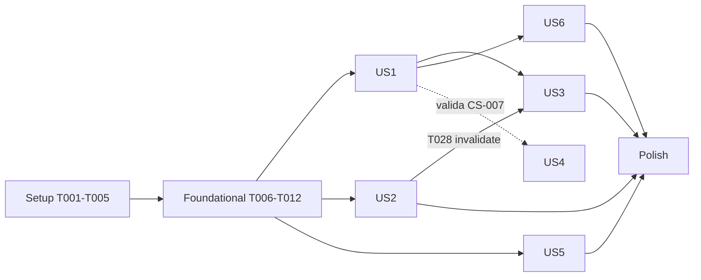

---

description: "Lista de tarefas: Otimizar Performance do CRM"
---

# Tasks: Otimizar Performance do CRM

**Input**: Documentos de design em `specs/001-otimizar-performance-crm/`

**Prerequisites**: plan.md, spec.md, research.md, data-model.md, contracts/, quickstart.md

**Tests**: **Incluídos.** A spec exige testes de regressão de totais e permissões (RF-023, CS-005) e uma medição comparável de antes e depois (RF-022). Os testes unitários ficam em `src/**/*.test.ts` (Vitest, ambiente `node`, que é o único glob que o `vitest.config.ts` aceita). A medição de aceite fica em `e2e/perf/`.

**Organization**: uma fase por user story da spec. US1–US4 são P1, US5–US6 são P2. **US4 é a Fase 2 de entrega** (sincronizador n8n, fora do repo) e não bloqueia o merge das outras.

## Format: `[ID] [P?] [Story] Description`

- **[P]**: pode rodar em paralelo (arquivo diferente, sem depender de tarefa incompleta)
- **[Story]**: US1…US6, conforme a spec
- Caminhos relativos à raiz do repo

## Convenções que valem para TODAS as tarefas

- Ler `AGENTS.md` antes. Next 16 tem APIs diferentes: consultar `node_modules/next/dist/docs/` antes de usar `after()`, route handlers ou config.
- Env var **só** via `src/lib/env.ts`. `createAdminClient()` **só** em código de servidor.
- Toda rota nova tem enforcement no servidor (`requireApiUser`/`requireApiPermission`/`resolveApiContext`).
- Migração nova é arquivo **novo** em `supabase/migrations/`. Nunca editar migração existente. Depois de aplicar: `get_advisors` (security e performance).
- `src/lib/server/crm-data.ts` usa **CRLF** e tem **bytes NUL literais** como separador de chave dentro de template strings (linhas ~457, 463, 946, 949). A T006 troca esses bytes por `\u0000`. Até lá, não reescrever essas linhas.
- Gates antes de cada commit: `npx eslint src e2e scripts`, `npm run typecheck`, `npm run test`.

---

## Phase 1: Setup (infraestrutura compartilhada)

**Purpose**: medir a linha de base **antes** de qualquer mudança e preparar o ambiente.

- [X] T001 Criar a branch `001-otimizar-performance-crm` a partir de `master` e confirmar que `.specify/feature.json` aponta para `specs/001-otimizar-performance-crm`
- [X] T002 Adicionar o projeto `perf` em `playwright.config.ts`: `{ name: "perf", testMatch: /perf\/.*\.perf\.ts$/, use: { ...devices["Desktop Chrome"], baseURL: process.env.PERF_BASE_URL } }`. No projeto `chromium` existente, adicionar `testIgnore: /perf\//` para o `npm run test:e2e` padrão não rodar a medição. Com `PERF_BASE_URL` definida, pular o `webServer` (`webServer: process.env.PERF_BASE_URL ? undefined : {...}`)
- [X] T003 Criar `e2e/perf/dashboard.perf.ts`. Fazer login uma vez com `PERF_USER_EMAIL`/`PERF_USER_PASSWORD` e salvar `storageState`. **Carga fria** ×30: `browser.newContext({ storageState })` novo a cada iteração, `page.goto("/")` e medir até `[data-dashboard-ready="true"]` (**se o atributo ainda não existir, usar como fallback a visibilidade do texto "Total leads"** e registrar `marker: "fallback"`). **Carga quente** ×30: na mesma aba, ir a `/leads` e voltar a `/` pelo link da sidebar, medindo até o mesmo marcador. Gravar `perf-results/<label>-<ISO>.json` com `{ label, baseURL, cold: number[], warm: number[], p50, p95 }` (`label` vem de `PERF_LABEL`, default `run`). Timeout de teste 15 min
- [X] T004 [P] Criar `scripts/perf-compare.mjs <baseline.json> <candidato.json>`: imprimir uma tabela com cold/warm p50/p95 dos dois arquivos e o delta %, e sair com código 1 se o candidato tiver `cold.p95 > 2000` ou `warm.p95 > 300`
- [ ] T005 Adicionar `perf-results/` ao `.gitignore`. Rodar a linha de base contra um preview do `master` atual com `PERF_LABEL=baseline` (quickstart §1) e anexar o JSON e o p50/p95 ao PR, ou registrar o resultado em `specs/001-otimizar-performance-crm/quickstart.md` numa seção "Linha de base medida"

---

## Phase 2: Foundational (pré-requisitos que bloqueiam as histórias)

**⚠️ CRITICAL**: US1, US2, US3, US5 e US6 dependem desta fase.

- [X] T006 Em `src/lib/server/crm-data.ts`, trocar os bytes NUL literais das template strings (linhas ~457, 463, 946, 949) pela escape `\u0000`, sem mudar o comportamento. Validar com `grep -c -P '\x00' src/lib/server/crm-data.ts` → `0` e `npm run test` verde
- [X] T007 [P] Criar `src/lib/server/select-all-pages.ts` exportando `export const PAGE_SIZE = 1000; export const MAX_ROWS = 20_000; export class RowLimitExceededError extends Error {}` e `export async function selectAllPages<T>(build: (from: number, to: number) => PromiseLike<{ data: T[] | null; error: unknown }>): Promise<T[]>`. A função chama `build(from, from + PAGE_SIZE - 1)` até vir uma página com menos de `PAGE_SIZE` linhas, lança o `error` recebido e lança `RowLimitExceededError` se o acumulado passar de `MAX_ROWS`, **nunca trunca**
- [X] T008 [P] Criar `src/lib/server/select-all-pages.test.ts`: 2.500 linhas simuladas → 3 chamadas e 2.500 itens na ordem. 0 linhas → 1 chamada e `[]`. Exatamente 1.000 → 2 chamadas. Erro na 2ª página → rejeita. 20.001 linhas → `RowLimitExceededError`
- [X] T009 Em `src/lib/server/api-auth.ts`, criar `export async function resolveApiContext(): Promise<{ ctx: { userId: string; role: string; permissions: Record<string, boolean> } | null; response: Response | null }>`. Fluxo: `(await createClient()).auth.getClaims()` e `claims.sub` como userId, depois **uma** leitura `createAdminClient().from("user_profiles").select("role,permissions").eq("id", userId).single()`. Sem claims → `401 { error: "Unauthorized" }`. Exportar também os helpers puros `isStaff(ctx)` (role ≠ `client` e não vazio), `canManage(ctx, perm)` (role em `superadmin`/`owner` **ou** `permissions[perm] === true`, mesma regra de `requireApiPermission`) e `isSuperAdmin(ctx)`
- [X] T010 Em `src/lib/server/api-auth.ts`, mudar `requireApiUser(opts?: { strict?: boolean })`: o padrão usa `auth.getClaims()` e devolve `{ user: { id: claims.sub, email: claims.email }, response }`. Com `strict: true`, mantém `auth.getUser()` (valida revogação no Auth server). Ajustar `requireApiPermission`, `requireStaffUser`, `requireSuperAdmin` e `requireAtendimentoScope` para aceitar e repassar `opts`. **`requireSuperAdmin` usa `strict: true` sempre.** Conferir que nenhum chamador usa campo de `user` além de `id`/`email`, e adaptar os que usarem
- [X] T011 Em todos os handlers **não-GET** de `src/app/api/**/route.ts` (POST/PATCH/PUT/DELETE, hoje 10 arquivos: `cobranca/disparo`, `cobranca/reenviar-nao-disparados`, `leads/[id]/financial-handoff`, `admin/users`, `admin/users/[id]`, `admin/leads/[id]`, `atendimento/conversations/[id]/messages`, `chat`, `generate-image`, `generate-image/condensadora-local`; conferir se não surgiu outro com `grep -rln "export async function \(POST\|PATCH\|PUT\|DELETE\)" src/app/api`), passar `{ strict: true }` para o `require*` usado. GETs ficam no padrão
- [X] T012 [P] Criar `src/lib/server/api-auth.test.ts`: `isStaff` (client → false, "" → false, vendor → true), `canManage` (owner sem flag → true, vendor com `manage_estoque: true` → true, manager sem flag → false para `manage_estoque`), `isSuperAdmin`. Com `vi.mock("@/lib/supabase/server")`: `resolveApiContext` com `getClaims` sem dados → status 401. `requireApiUser({ strict: true })` chama `getUser` e **não** `getClaims`

**Checkpoint**: autenticação verificada localmente disponível, paginação completa pronta, `crm-data.ts` seguro para editar.

---

## Phase 3: User Story 1 — Abrir o dashboard sem espera operacional (P1) 🎯 MVP

**Goal**: dashboard utilizável em p95 ≤ 2 s numa carga fria, com ≤ 12 leituras e totais corretos.

**Independent Test**: quickstart §4, linhas CS-001, CS-003 e "Região". Cruzar os números do snapshot com `select * from product_metrics()` e com a linha de base.

### Tests for User Story 1

- [ ] T013 [P] [US1] Criar `src/lib/server/product-metrics.test.ts` testando a função pura `aggregateProductMetrics(rows: { tabela: string; id: string; codigo_erp: string | null; estoque: number | null }[])` (da T016), que espelha a SQL, com: vazio → todos 0 e `sincronizado=false`. Todos `estoque` nulos → `com_estoque_conhecido=0`, `zerados=0`, `sincronizado=false` (**zero ≠ não sincronizado**). Mesmo `codigo_erp` em 3 tabelas com estoque 5 → conta 1 em `total_distintos` e 1 em `estoque_baixo`. Dois `codigo_erp` nulos em tabelas diferentes → contam 2 (fallback `linha:<tabela>:<id>`). Linha de `products_builder_architect` (sem estoque) → só entra em `total_distintos`. 1.500 chaves → `total_distintos=1500`. Estoque 0 → `zerados`. 11 → `disponiveis` e fora de `estoque_baixo`
- [ ] T014 [P] [US1] Criar `src/lib/server/dashboard-snapshot.test.ts` com as seções mockadas (`vi.mock`): role `client` → `activity` e `urgentFollowups` com `{ status: "forbidden" }`. vendor sem `manage_estoque` → `inventory` `forbidden` e as outras `ok`. owner → `inventory` `ok`. Seção `pending` lançando erro → `pending` `{ status: "error" }` e `summary` `ok`. `sections=agents` → só a chave `agents` na resposta. `sections=foo` → 400. `fetchCore` chamado **uma** vez mesmo com summary+pending+agents pedidas. `summary`, `pending` e `inventory` recebem o **mesmo** objeto de `product_metrics`

### Implementation for User Story 1

- [ ] T015 [P] [US1] Criar `vercel.json` na raiz com `{ "$schema": "https://openapi.vercel.sh/vercel.json", "regions": ["gru1"] }` (research D1). No preview, confirmar via `VERCEL_REGION` (gravado nos traços a partir da T051/T053) ou nos logs da função. Se o plano da Vercel rejeitar `regions`, configurar `gru1` em Settings → Functions e registrar isso em `AGENTS.md`
- [ ] T016 [US1] Criar a migração `supabase/migrations/20260923_product_metrics.sql` com a função `public.product_metrics()` exatamente como em `data-model.md §2`: `returns table (total_distintos integer, com_estoque_conhecido integer, disponiveis integer, zerados integer, estoque_baixo integer, sincronizado boolean)`, `language sql stable security invoker set search_path = public`. Chave = `coalesce(codigo_erp, 'linha:' || tabela || ':' || id)`. Estoque do produto = `max(estoque)` entre `products_consumer`, `products_reseller` e `products_installer`. `products_builder_architect` entra só na contagem de chaves. Grants: `revoke execute on function public.product_metrics() from public, anon, authenticated; grant execute on function public.product_metrics() to service_role;`. No cabeçalho, o `down`: `drop function public.product_metrics();`. Na mesma tarefa, exportar de `src/lib/server/crm-data.ts` a função pura `aggregateProductMetrics` com a mesma semântica (usada só pelos testes, T013)
- [ ] T017 [US1] Aplicar a migração da T016 (MCP `apply_migration`, projeto `swcqvrowqwylcegrcesu`). Rodar `select * from public.product_metrics();` e comparar com os números atuais das rotas `/api/inventory/summary?scope=summary` (total) e do card `produtos_disponiveis`. Divergência só é aceita se for explicada por truncamento ou dedupe. Rodar `get_advisors` security e performance
- [ ] T018 [US1] Em `src/lib/server/crm-data.ts`, criar `async function fetchProductMetrics(): Promise<ProductMetrics>` com `createAdminClient().rpc("product_metrics").single()` e substituir por ela: `contarProdutosDisponiveis` (em `getDashboardSummary`), o `semEstoque` paginado (em `getPendingCenter`) e `getInventoryCounts` (`total_products` e `estoqueSincronizado`). Remover as três implementações paginadas antigas. `out_of_stock_products` passa a usar `zerados`
- [ ] T019 [US1] Em `src/lib/server/crm-data.ts`, trocar `coreTables` para projeção explícita + `selectAllPages` (T007): `followups` → `id,lead_id,followup_sent,respondeu,status,created_at,updated_at,tipo,ultima_msg_lead`; `conversations` → `id,vendor_id,lead_id,chatwoot_conv_id,started_at`; `vendors` → `id,name,active,segment,wa_phone,chatwoot_inbox_id,created_at`; `cobranca_log` → `id,telefone,nome,valor,vencimento,status_disparo,respondeu,pagamento_confirmado,data_disparo,created_at,metadata`; `quotes` → `id,price_offered,created_at`; `sales` → `id,status,confirmed_at,final_price,vendor_id`; `leads` mantém `LEAD_SELECT`. **Antes de fechar cada lista, conferir com grep todos os campos usados de `FollowupRow`/`ConversationRow`/`VendorRow`/`CobrancaRow`/`QuoteRow`/`SaleRow` em `crm-data.ts` e `src/lib/followups.ts` (`isFollowupPendente`) e incluir os que faltarem.** Em `getPendingCenter`, trocar `sheet_sources.select("*")` por `select("id,last_synced_at")`
- [ ] T020 [US1] Refatorar `src/lib/server/crm-data.ts` para expor as seções como funções que recebem os dados já carregados, sem buscar nada por conta própria: `buildSummary(core, handoffDecisions, productMetrics)`, `buildPending(core, sheetSources, productMetrics)`, `buildAgents(core)`, `buildInventoryCounts(productMetrics)`, `buildActivity(core)` (mesma regra de `getRecentActivity` em `src/lib/supabase/queries.ts`: 6 leads não-COBRANCA, 6 `cobranca_log` por `data_disparo` e 6 followups `respondeu=true`, no máximo 15 no total, ordenados por data) e `countUrgentFollowups(core)` (mesma regra de `getUrgentFollowupsCount`: `filtrarPendentes` + `updated_at < now-48h`, aplicada em memória via `isFollowupPendente`). Manter `getDashboardSummary`, `getPendingCenter`, `getAgentSummary` e `getInventorySummary` como wrappers finos (carregam e chamam `build*`) com o **mesmo formato de resposta**. Mover o tipo `ActivityItem` para `src/types/api.ts` e reexportar de `src/lib/supabase/queries.ts`
- [ ] T021 [US1] Criar `src/lib/server/dashboard-snapshot.ts` com `SECTION_NAMES = ["summary","pending","agents","inventory","activity","urgentFollowups"] as const` e `buildDashboardSnapshot(ctx, sections)`. Carregar **em paralelo e uma vez só** o que as seções pedidas precisam (`fetchCore`, `handoffDecisions` só se tiver summary, `fetchProductMetrics` só se tiver summary/pending/inventory, `sheet_sources` só se tiver pending). Calcular cada seção em `Promise.allSettled`. Aplicar as permissões do contrato: `inventory` exige `canManage(ctx,"manage_estoque")`, `activity`/`urgentFollowups` exigem `isStaff(ctx)`. Seção sem permissão devolve `{status:"forbidden"}` **sem carregar** o dado. Erro devolve `{status:"error", message:"Erro ao carregar esta seção."}` e loga no servidor. Adicionar `DashboardSnapshotResponse` e `SectionResult<T>` a `src/types/api.ts`, conforme `contracts/dashboard-snapshot.md`
- [ ] T022 [US1] Criar `src/app/api/dashboard/snapshot/route.ts` (GET): `resolveApiContext()` (401 se falhar), parse de `sections` (vazio = todas, nome desconhecido → `400 { error: "Seção inválida: <nome>" }`), `buildDashboardSnapshot` e resposta com `Cache-Control: private, no-store`. Se **todas** as seções vierem `error`, responder `500 { error: "Erro interno. Tente novamente." }`
- [ ] T023 [US1] Em `src/app/api/dashboard/summary/route.ts`, `src/app/api/dashboard/pending-center/route.ts`, `src/app/api/agents/summary/route.ts` e `src/app/api/inventory/summary/route.ts`, manter as mesmas regras de auth e o mesmo contrato, só delegando aos wrappers da T020. `/agentes` e `/demanda-estoque` continuam iguais
- [ ] T024 [US1] Em `src/app/page.tsx`, trocar as 4 chamadas `useApi` e as chamadas diretas `getRecentActivity`/`getUrgentFollowupsCount` por **uma** `useApi<DashboardSnapshotResponse>("/api/dashboard/snapshot")`. Derivar `summary`, `pending`, `agents`, `inventory`, `activity` e `urgentFollowups` de `data.sections`. Cada bloco da tela trata `forbidden` (oculta ou mostra "sem acesso", como hoje acontece quando `/api/inventory/summary` devolve 403) e `error` (usa `ConsoleError` **só naquele bloco**, as outras seções continuam visíveis, CS-010). Estados vazios e "não sincronizado" continuam distintos de zero
- [ ] T025 [US1] Em `src/app/page.tsx`, marcar o elemento raiz com `data-dashboard-ready={summaryPronto && pendingPronto ? "true" : "false"}` (pronto = seção `ok` **ou** `error`, ou seja, já resolvida)
- [ ] T026 [US1] Verificar a US1: `npm run test`, `npm run typecheck` e `npm run build`. Abrir o preview e comparar os cards com a linha de base (T005). Rodar `PERF_LABEL=us1` (quickstart §4) e registrar p50/p95 frio e a região

**Checkpoint**: dashboard numa carga só, com totais corretos. MVP entregável.

---

## Phase 4: User Story 2 — Navegar e retornar sem recarregar tudo (P1)

**Goal**: voltar a uma tela visitada mostra o último estado válido em ≤ 300 ms p95, revalidando em segundo plano.

**Independent Test**: quickstart §4, CS-002. Dashboard → `/leads` → dashboard sem skeleton completo. Com a rede offline no DevTools, o dado continua na tela e aparece o aviso de desatualizado.

### Tests for User Story 2

- [ ] T027 [P] [US2] Criar `src/lib/api-cache.test.ts` para o store puro (T028), com `vi.useFakeTimers()` e `fetch` mockado: entrada fresca (< 30.000 ms) não dispara fetch. Entrada velha devolve o dado na hora **e** dispara fetch. Duas assinaturas da mesma chave → 1 fetch (dedup em voo). Resposta da seq 1 chegando depois da seq 2 é **descartada**. Falha com dado presente mantém `data`, seta `error` e `isStale=true`. `invalidate(prefix)` marca como velho e revalida assinantes. `clearApiCache()` esvazia tudo. A chave ignora o parâmetro `_r`

### Implementation for User Story 2

- [ ] T028 [US2] Criar `src/lib/api-cache.ts` (módulo puro, sem React): `Map<string, Entry>` com `{ data, fetchedAt, seq, acceptedSeq, inflight, error, subscribers }` (data-model §4). Exportar `getEntry`, `subscribe(key, cb)`, `load(key, fetcher, { freshMs = 30_000, force })`, `invalidate(match: string | ((key: string) => boolean))`, `clearApiCache()` e `cacheKey(url)` (remove `_r`). **Proibido** usar `localStorage`, `sessionStorage` ou IndexedDB
- [ ] T029 [US2] Reescrever `useApi` em `src/lib/client-api.ts` sobre `api-cache.ts`, mantendo a assinatura e os campos atuais `{ data, loading, isInitialLoading, error }` e acrescentando `isStale` e `revalidate`. Manter timeout de 15 s, `AbortController` e a mensagem de timeout atual. `isInitialLoading` só é `true` sem dado
- [ ] T030 [US2] Em `src/hooks/use-supabase.ts`, aceitar uma chave opcional como primeiro argumento (`useSupabase(key, fn, deps)`, mantendo a assinatura antiga `useSupabase(fn, deps)` sem cache) e usar `api-cache.ts` quando houver chave. Migrar os usos de `useSupabase` em telas de navegação frequente (`grep -rn "useSupabase(" src/app`) para passar uma chave estável
- [ ] T031 [US2] Em `src/hooks/use-current-user.tsx`, chamar `clearApiCache()` no evento `SIGNED_OUT`
- [ ] T032 [US2] Criar um indicador não bloqueante de dado desatualizado reutilizável em `src/components/console/console-shell.tsx` (ex.: `ConsoleStaleBadge`, usando as variáveis de tema `var(--text-muted)`, sem `bg-white`) e exibi-lo em `src/app/page.tsx` e `src/app/leads/page.tsx` quando `isStale`
- [ ] T033 [US2] Revisar os skeletons de `src/app/page.tsx`, `src/app/leads/page.tsx`, `src/app/agentes/page.tsx` e `src/app/demanda-estoque/page.tsx` para usar `isInitialLoading` (e não `loading`) como condição do skeleton completo. Adicionar `data-skeleton="full"` ao skeleton completo do dashboard (usado pelo quickstart §4, CS-002)
- [ ] T034 [US2] Verificar a US2: `npm run test` e o Playwright `PERF_LABEL=us2` (`warm.p95 ≤ 300`). Checar manualmente o cenário offline

**Checkpoint**: retorno instantâneo sem skeleton.

---

## Phase 5: User Story 3 — Atualizações em tempo real sem tempestade de carga (P1)

**Goal**: uma mudança revalida só as seções dependentes, uma vez por janela de 2 s.

**Independent Test**: quickstart §4, CS-004. Alterar 1 linha de `conversations` pelo SQL editor → 1 request `snapshot?sections=agents,summary`. Nenhuma request de `pending`, `inventory` ou `activity`.

### Tests for User Story 3

- [ ] T035 [P] [US3] Criar `src/lib/realtime-sections.test.ts`: `sectionsFor("conversations")` = `["agents","summary"]`, **sem** `pending`/`inventory`/`activity`. `sectionsFor("leads")` = `["activity","agents","pending","summary"]`. `sectionsFor("followups")` inclui `urgentFollowups`. `sectionsFor("cobranca_log")` = `["activity","pending","summary"]`. Nenhum mapeamento contém `inventory`. Batcher com fake timers: 3 eventos (`leads`, `conversations`, `leads`) em 1.500 ms → **1** flush após 2.000 ms com a união ordenada. `dispose()` antes do flush → nenhum flush

### Implementation for User Story 3

- [ ] T036 [US3] Criar `src/lib/realtime-sections.ts` com `SECTION_DEPENDENCIES` exatamente como a tabela de `contracts/realtime-invalidation.md` e `sectionsFor(table)` (ordenado). Criar também `createSectionBatcher(onFlush: (sections: string[]) => void, windowMs = 2000)` com `add(table)` e `dispose()`
- [ ] T037 [US3] Em `src/app/page.tsx`, substituir o `refreshBatched` de 500 ms e o `refreshTick`: cada `postgres_changes` chama `batcher.add(table)`. No flush, `fetch("/api/dashboard/snapshot?sections=" + secoes.join(","))` e **mesclar** as seções devolvidas no estado atual do snapshot (as seções não pedidas continuam). Descartar resposta de flush mais antigo que o último aplicado (sequência). No unmount, `batcher.dispose()` e `removeChannel`. Manter o selo `live`/`paused`
- [ ] T038 [US3] Criar `src/hooks/use-urgent-followups.tsx` com `UrgentFollowupsProvider` e `useUrgentFollowups()` → `{ count, setFromSnapshot(n), refresh() }`. `refresh()` chama `getUrgentFollowupsCount()` com dedup em voo e intervalo de 5 min dentro do provider. Registrar o provider em `src/components/layout/providers.tsx`, dentro de `CurrentUserProvider`, e só ativar o intervalo com `profile` carregado
- [ ] T039 [US3] Em `src/components/layout/sidebar.tsx`, remover o `getUrgentFollowupsCount` direto e o `setInterval` próprio e ler `count` de `useUrgentFollowups()`. Em `src/app/page.tsx`, quando a seção `urgentFollowups` chegar `ok`, chamar `setFromSnapshot(data.count)` e usar o `count` do contexto no banner
- [ ] T040 [US3] Em `src/app/leads/page.tsx` (canal na linha ~156) e `src/app/cobranca/page.tsx`, trocar o debounce atual pela janela de 2.000 ms e o incremento de `refreshTick` na URL por `invalidate()` do `api-cache` para as chaves da tela. **Manter o agrupamento** (`fetchLogsBatched` em cobrança continua agrupando, ver AGENTS.md)
- [ ] T041 [US3] Criar a migração `supabase/migrations/20260923_rls_initplan_my_role.sql` (research D10): para **cada** política de `pg_policies` em `public` cuja `qual` ou `with_check` contém `my_role()` sem `SELECT` (activity_log, billing, cobranca_handoff_boleto_decisions ×3, cobranca_log ×2, conversations, crm_image_generations ×2, financial_handoff_resolutions ×2, followups, image_generations, leads, messages, products_* ×4, quotes, sales, user_profiles ×4, vendors ×2), `drop policy` + `create policy` com **o mesmo nome, comando, roles e expressão**, trocando `my_role()` por `(select public.my_role())`. No cabeçalho, o `down` com as definições originais (copiar de `pg_policies` antes de aplicar). A mudança acelera as queries do browser e a avaliação do Realtime, porque RLS é checada por assinante e por evento
- [ ] T042 [US3] Antes de aplicar a T041, salvar `select tablename, policyname, cmd, roles, qual, with_check from pg_policies where schemaname='public' order by 1,2` em `specs/001-otimizar-performance-crm/rls-before.json`. Aplicar, repetir a consulta e conferir que só `qual`/`with_check` mudaram e só no embrulho `(select …)`. Rodar a query de verificação do quickstart §3 (esperado: 0 linhas) e `get_advisors` security e performance
- [ ] T043 [US3] Verificar a US3: `npm run test`. Com o dashboard aberto no preview, alterar 1 linha de `conversations` e depois 1 de `cobranca_log` pelo SQL editor e conferir no DevTools as requests e as seções (CS-004). Sair da página e alterar de novo: nenhuma request

**Checkpoint**: realtime seletivo e contagem urgente única.

---

## Phase 6: User Story 5 — Entrar uma vez e manter a sessão sem trabalho duplicado (P2)

> Fica antes da US4 porque a US4 é a Fase 2 (fora do repo) e não bloqueia o merge.

**Goal**: ≤ 1 carregamento de perfil por estado efetivo de sessão, com as permissões intactas.

**Independent Test**: quickstart §4, CS-008. Login, trocar de aba 3× e contar as requests a `user_profiles` no DevTools: 1. Vendor sem `manage_estoque` continua recebendo 403 em `/api/inventory/summary`.

### Tests for User Story 5

- [ ] T044 [P] [US5] Criar `src/hooks/profile-loader.test.ts` para a função pura `shouldReloadProfile(event, nextUserId, currentUserId)` (T045): `INITIAL_SESSION` com id novo → true. `TOKEN_REFRESHED` com o mesmo id → **false**. `SIGNED_IN` → true. `USER_UPDATED` → true. `SIGNED_OUT` → false (limpa). Qualquer evento com id diferente do atual → true

### Implementation for User Story 5

- [ ] T045 [US5] Criar `src/hooks/profile-loader.ts` exportando `shouldReloadProfile` e reescrever `src/hooks/use-current-user.tsx`: **remover** a chamada `load()` do mount (o `INITIAL_SESSION` do `onAuthStateChange` já chega). Usar `session?.user.id` do evento em vez de `auth.getUser()`. Recarregar o perfil só quando `shouldReloadProfile` for verdadeiro, com dedup em voo. Buscar `select("id,email,full_name,role,permissions")`. **Não** setar `loading=true` em refresh (regra do AGENTS.md). No `SIGNED_OUT`: `setProfile(null)`, `setLoading(false)`, `clearApiCache()` (T031)
- [ ] T046 [US5] Em `src/proxy.ts`, trocar `supabase.auth.getSession()` por `supabase.auth.getClaims()`. Sessão válida = `data?.claims` presente. Manter os redirects de `/login` e o rate limit atual. Atualizar o comentário ("verificação local da assinatura ES256")
- [ ] T047 [US5] Verificar a US5 com os testes negativos de autorização: sem cookie → `/` redireciona para `/login` e `/api/dashboard/snapshot` → 401. Vendor sem `manage_estoque` → `/api/inventory/summary` 403 e `inventory: forbidden` no snapshot. Role `client` → `activity`/`urgentFollowups` `forbidden`. POST em `/api/cobranca/disparo` sem permissão → 403. Contar as requests a `user_profiles` no login e em 3 trocas de aba (CS-008)

**Checkpoint**: login e sessão sem trabalho duplicado, permissões preservadas.

---

## Phase 7: User Story 6 — Diagnosticar regressões com evidência ponta a ponta (P2)

**Goal**: toda jornada do dashboard com `trace_id`, etapas do browser e do servidor, contagem de operações e sem dado pessoal.

**Independent Test**: quickstart §4, CS-003 e CS-009. Para 10 `trace_id` da rodada de aceite, existem etapas `browser` **e** `server`, `supabase_requests` no `total` ≤ 12 e nenhum e-mail ou telefone na tabela.

### Tests for User Story 6

- [ ] T048 [P] [US6] Criar `src/lib/perf/trace-validate.test.ts` para `parseBrowserTrace(body)` (T052): aceita o payload do contrato. Rejeita `traceId` que não é UUID, `stage` fora de `["ttfb","ready","hydrated","revalidated"]`, `durationMs` negativo ou `>= 600000`, `journey`/`loadKind`/`outcome` fora do enum e mais de 20 etapas. **Descarta** campos extras (ex. `email`, `userId` no body não passa adiante)
- [ ] T049 [P] [US6] Criar `src/lib/perf/trace-server.test.ts`: `withTrace` + `countSupabaseRequest()` chamado 3× dentro do contexto → `supabase_requests = 3`. Fora do contexto → não lança. `serverTimingHeader([{stage:"auth",durationMs:12},{stage:"total",durationMs:170}])` = `"auth;dur=12, total;dur=170"`

### Implementation for User Story 6

- [ ] T050 [US6] Criar a migração `supabase/migrations/20260923_performance_traces.sql` com a tabela de `data-model.md §1`, **com as restrições exatas**: `id bigint generated always as identity primary key`, `trace_id uuid not null`, `journey text not null check (journey in ('dashboard','leads','login','other'))`, `origin text not null check (origin in ('browser','server'))`, `stage text not null check (length(stage) <= 64)`, `duration_ms integer not null check (duration_ms >= 0 and duration_ms < 600000)`, `outcome text not null check (outcome in ('ok','error','forbidden','timeout'))`, `load_kind text check (load_kind in ('cold','warm'))`, `supabase_requests smallint`, `route text`, `deployment text`, `region text`, `user_id uuid` (**sem FK**), `created_at timestamptz not null default now()`. Índices `(trace_id)` e `(created_at desc)`. `alter table … enable row level security`. Política `superadmin_read_performance_traces` for select using `((select public.my_role()) = 'superadmin')`. **Nenhuma** política de insert/update/delete. `revoke all on public.performance_traces from anon;`. Retenção: `select cron.schedule('purge-performance-traces', '17 3 * * *', $$delete from public.performance_traces where created_at < now() - interval '30 days'$$);`. Cabeçalho com o `down` (`select cron.unschedule('purge-performance-traces'); drop table public.performance_traces;`). Aplicar e rodar `get_advisors`
- [ ] T051 [US6] Em `src/lib/env.ts`, adicionar `VERCEL_REGION = clean(process.env.VERCEL_REGION) || "local"` e `VERCEL_GIT_COMMIT_SHA = clean(process.env.VERCEL_GIT_COMMIT_SHA).slice(0, 7) || "local"`
- [ ] T052 [US6] Criar `src/lib/perf/trace-validate.ts` com `parseBrowserTrace(body: unknown)`, que devolve o payload normalizado ou `null`, conforme as regras de `contracts/performance-traces.md` ("Validação")
- [ ] T053 [US6] Criar `src/lib/perf/trace-server.ts` (só servidor): `AsyncLocalStorage<{ traceId, stages: Stage[], supabaseRequests: number }>`, `withTrace(traceId, fn)`, `timeStage(name, fn)`, `countSupabaseRequest()`, `serverTimingHeader(stages)`, `readTraceId(request)` (usa `x-trace-id` se for UUID v4, senão `crypto.randomUUID()`) e `persistServerTrace({ traceId, journey, route, userId, stages, outcome })`, que grava com `createAdminClient().from("performance_traces").insert(...)` e `region: VERCEL_REGION` e `deployment: VERCEL_GIT_COMMIT_SHA`, engolindo e logando erro. **Nunca** gravar e-mail, telefone, token, query string nem corpo
- [ ] T054 [US6] Em `src/lib/supabase/fetch-with-timeout.ts`, chamar `countSupabaseRequest()` (T053) a cada request. O arquivo é usado por `server.ts` e `admin.ts`: importar só do lado servidor, sem quebrar `client.ts` (que não usa esse fetch)
- [ ] T055 [US6] Instrumentar `src/app/api/dashboard/snapshot/route.ts` e `src/lib/server/dashboard-snapshot.ts`: `withTrace(readTraceId(req))` envolvendo o handler, `timeStage("auth")`, `"profile"`, `"core"`, `"products"`, `"section:<nome>"` e `"total"` (com `supabase_requests`). Headers `Server-Timing` e `x-trace-id`. `traceId` no body. Gravar com `after(() => persistServerTrace(...))` de `next/server` (**conferir a API em `node_modules/next/dist/docs/` antes**)
- [ ] T056 [US6] Criar `src/app/api/perf/traces/route.ts` (POST): `requireApiUser()`, `parseBrowserTrace` (400 se `null`), `user_id` **dos claims**, `origin: "browser"`, grava via admin em `after()` e responde `202` sem corpo. Em `src/proxy.ts`, adicionar `"/api/perf/traces": 60` a `RATE_LIMITS`
- [ ] T057 [US6] Criar `src/lib/perf/trace-client.ts`: `startJourney(journey, loadKind)` → `traceId` (`crypto.randomUUID()`), `mark(stage, durationMs, outcome)` e `flush()` com `navigator.sendBeacon("/api/perf/traces", Blob JSON)` e `fetch(..., { keepalive: true })` como fallback. Em `src/app/page.tsx`, iniciar a jornada no mount (`cold` se o cache do snapshot estava vazio, `warm` se não), mandar `x-trace-id` na chamada do snapshot (estender `useApi`/`api-cache` para aceitar headers) e marcar `ttfb` e `ready` (quando `data-dashboard-ready` vira `true`), depois `flush()`
- [ ] T058 [US6] Verificar a US6: rodar `PERF_LABEL=us6` e executar as consultas do quickstart §4 para CS-003 (`max(supabase_requests) ≤ 12`), CS-009 (10 `trace_id` com `browser` e `server`) e região (`gru1`). Conferir com `select * from performance_traces limit 50` que não há dado pessoal. Logado como vendor, `select` direto na tabela pelo client → 0 linhas

**Checkpoint**: evidência ponta a ponta disponível para qualquer regressão futura.

---

## Phase 8: User Story 4 — CRM responsivo durante sincronizações (P1, **Fase 2 de entrega**)

> Fora deste repositório (n8n "ERP — SALDO DE ESTOQUE"). **Não bloqueia** o merge das fases 1–7 (clarificação Q4). Procedimento completo em `contracts/erp-sync-change.md`.

**Goal**: o sync regrava só o que mudou (CS-006) e o dashboard mantém p95 ≤ 2 s durante o sync (CS-007).

**Independent Test**: duas execuções seguidas sem mudança no ERP → `rowCount = 0` em todos os UPDATEs. `PERF_LABEL=sync` rodando durante uma execução → `cold.p95 ≤ 2000`.

- [ ] T059 [US4] Nomear o responsável pelo workflow n8n "ERP — SALDO DE ESTOQUE" e registrar o nome no campo **Responsável** de `specs/001-otimizar-performance-crm/contracts/erp-sync-change.md` (RF-017). **Bloqueia T060–T064**
- [ ] T060 [US4] Recarregar a aba do editor do n8n (armadilha do AGENTS.md), exportar o workflow para `docs/backups/n8n/erp-saldo-estoque-<AAAA-MM-DD>.json` e registrar a linha de base: `select relname, n_tup_upd from pg_stat_user_tables where relname like 'products_%' order by 1`
- [ ] T061 [US4] No workflow, acrescentar `AND p.estoque IS DISTINCT FROM v.qtd` a todo `UPDATE products_* p SET estoque = v.qtd FROM (VALUES …)` e `AND p.estoque_transito IS DISTINCT FROM v.qtd` a todo `UPDATE … SET estoque_transito`. Fazer o nó registrar `rowCount` de cada UPDATE no log da execução
- [ ] T062 [US4] No upsert de catálogo que reescreve `content`/`embedding` (PostgREST em `products_installer` e similares), comparar o hash de `content`/`nome` com o valor gravado e só gerar embedding e enviar as linhas alteradas
- [ ] T063 [US4] Validar CS-006: depois de 2 execuções, o delta de `n_tup_upd` por tabela é ≤ o número de produtos com saldo alterado, e uma execução sem mudança no ERP dá `rowCount = 0`. Registrar os números em `contracts/erp-sync-change.md`
- [ ] T064 [US4] Validar CS-007: rodar `PERF_LABEL=sync npx playwright test --project=perf` durante uma execução do sync e conferir `cold.p95 ≤ 2000` e os cards do dashboard sem valor parcial. Rollback: reimportar o JSON da T060

**Checkpoint**: resultado completo da feature, com as fases 1 e 2 entregues.

---

## Phase 9: Polish & Cross-Cutting Concerns

- [ ] T065 [P] Atualizar `AGENTS.md`. **Estoque**: `estoque` e `estoque_transito` **já vêm preenchidos** pelo n8n em ~97% das linhas, remover a afirmação de que estão `null`. **Deploy**: região `gru1` via `vercel.json`. **Estrutura**: `/api/dashboard/snapshot`, `/api/perf/traces`, `lib/api-cache.ts`, `lib/realtime-sections.ts`, `lib/perf/`, `hooks/use-urgent-followups.tsx`. **Auth**: `getClaims` em leitura e `strict` (getUser) em mutação. **Migrações**: última passa a ser a de `20260923_*`. **Armadilhas**: realtime agora com janela de 2 s por seção
- [ ] T066 [P] Atualizar `docs/backend/api-contracts.md` com `GET /api/dashboard/snapshot` e `POST /api/perf/traces` (apontando para `specs/001-otimizar-performance-crm/contracts/`)
- [ ] T067 Remover de `src/lib/supabase/queries.ts` o uso direto de `getRecentActivity` se não sobrar nenhum chamador (`grep -rn "getRecentActivity" src`), e manter `getUrgentFollowupsCount` só para o provider
- [ ] T068 Rodar o aceite final completo no preview (quickstart §4 inteiro), `node scripts/perf-compare.mjs perf-results/baseline-*.json perf-results/final-*.json`, e anexar ao PR a tabela de antes e depois com carga fria, carga quente, p50, p95, operações e equivalência dos indicadores (RF-022)
- [ ] T069 Rodar os gates finais: `npx eslint src e2e scripts`, `npm run typecheck`, `npm run test`, `npm run build` e `get_advisors` (security e performance). Abrir o PR para `master` só com as fases 1–7

---

## Dependencies & Execution Order

### Phase Dependencies

- **Setup (Fase 1)**: sem dependências. **T005 (linha de base) precisa terminar antes de qualquer merge.**
- **Foundational (Fase 2)**: depende do Setup e bloqueia US1, US2, US3, US5 e US6.
- **US1 (Fase 3)**: depende da Foundational. É o MVP.
- **US2 (Fase 4)**: depende da Foundational. Integra com a US1 (dashboard), mas funciona sozinha em `/leads`, `/agentes` e `/demanda-estoque`.
- **US3 (Fase 5)**: depende da **US1** (snapshot com `sections`) e da T028 da US2 (`invalidate` usado na T040). T041 e T042 (RLS) são independentes e podem ir antes.
- **US5 (Fase 6)**: depende da Foundational (T010). T031 (US2) e T045 editam o mesmo arquivo, então **T045 incorpora a T031** se a US2 ainda não foi feita.
- **US6 (Fase 7)**: depende da US1 (instrumenta o snapshot). T050–T054 podem começar logo depois da Foundational.
- **US4 (Fase 8)**: independente do código, mas só faz sentido validar o CS-007 com a US1 no ar. Bloqueada pela T059.
- **Polish (Fase 9)**: depois das fases 1–7.

### User Story Dependencies



### Within Each User Story

- Testes primeiro, falhando antes da implementação
- Migração → aplicar → `get_advisors` → código que a usa
- Funções puras (`build*`, store, mapa) → rota/hook → página

---

## Parallel Opportunities

- **Setup**: T004 ∥ T003
- **Foundational**: T007 ∥ T008 ∥ T012 (T009–T011 são sequenciais no mesmo arquivo `api-auth.ts`)
- **US1**: T013 ∥ T014 ∥ T015. T016/T017 (banco) ∥ T019 (projeções)
- **US2**: T027 ∥ T028 começam juntas (teste primeiro)
- **US3**: T035 ∥ T041/T042 (RLS é só banco) ∥ T038
- **US6**: T048 ∥ T049 ∥ T050 ∥ T051
- **Entre histórias**: depois da Foundational, US1 ∥ US2 ∥ US5 ∥ (T050–T054 da US6)
- **Polish**: T065 ∥ T066

## Parallel Example: User Story 1

```bash
# Testes e config independentes:
Task: "T013 product-metrics.test.ts em src/lib/server/"
Task: "T014 dashboard-snapshot.test.ts em src/lib/server/"
Task: "T015 vercel.json com regions gru1"

# Banco e código em paralelo:
Task: "T016+T017 migração product_metrics + aplicar + get_advisors"
Task: "T019 projeções + selectAllPages em coreTables"
```

## Parallel Example: User Story 6

```bash
Task: "T048 trace-validate.test.ts"
Task: "T049 trace-server.test.ts"
Task: "T050 migração performance_traces"
Task: "T051 VERCEL_REGION/VERCEL_GIT_COMMIT_SHA em env.ts"
```

---

## Implementation Strategy

### MVP First (User Story 1 Only)

1. Setup, com a **linha de base medida** (T005)
2. Foundational
3. US1: região + snapshot + `product_metrics` + projeções
4. **STOP and VALIDATE**: CS-001, CS-003 e CS-005 no preview. Só a região `gru1` já deve derrubar boa parte dos 13 s
5. Merge possível já aqui, se quiser entregar em partes

### Incremental Delivery

1. Setup + Foundational
2. US1 → validar → (merge opcional)
3. US2 + US5 em paralelo → validar CS-002 e CS-008
4. US3 → validar CS-004
5. US6 → validar CS-003 e CS-009 com evidência
6. Polish → PR das fases 1–7
7. **Fase 2**: US4 no n8n, com responsável nomeado

### Notas

- O marcador [P] indica arquivo diferente e nenhuma dependência pendente
- Commitar a cada tarefa ou grupo lógico, com os gates verdes
- Nenhuma tarefa adiciona dependência npm (RF-024)
